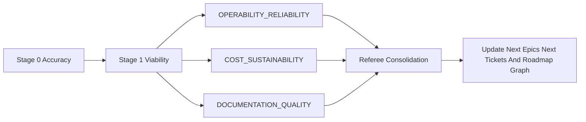

# Lens Agent Orchestration Guide

This guide defines how lens agents are used without changing the core review contract.

## Operating model

- Keep SKILL.md as the single orchestrator.
- Run selected lens agents in parallel during Stage 2.
- Keep one referee consolidation step for final prioritization and routing.

## Recommended initial lens-agent set

1. OPERABILITY_RELIABILITY
2. COST_SUSTAINABILITY
3. DOCUMENTATION_QUALITY

## Invocation order

1. Stage 0 accuracy gate
2. Stage 1 viability gate
3. Lens agents in parallel (selected set)
4. Referee consolidation
5. Artifact generation and roadmap updates

## Guardrails

- All lens agents must emit OUTPUT_SCHEMA.md format.
- No lens agent writes artifacts directly.
- Only the orchestrator writes NEXT_TICKETS and NEXT_EPICS.
- Referee resolves overlap and disagreement.

## Change workflow

1. Tune one lens agent spec.
2. Run a focused review to verify output quality.
3. Compare against prior run for noise and coverage.
4. Promote change into quarterly runs once stable.

## Stages

- **Stage 0 — Accuracy:** establish a reliable baseline and flag document drift.
- **Stage 1 — Viability:** confirm the review should proceed and carry forward key concerns.
- **Stage 2 — Lens Agents:** run selected lenses in parallel to gather focused findings.
- **Stage 3 — Referee:** merge overlap, resolve disagreements, and finalize priorities.
- **Stage 4 — Roadmap Update:** update `NEXT_EPICS`, `NEXT_TICKETS`, and `ROADMAP_GRAPH` with consistent rules.

## Mermaid flow

