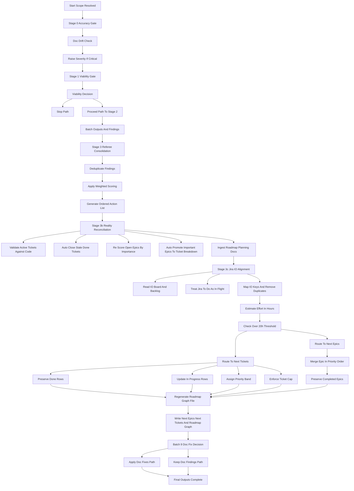

# Roadmap Decision Flow

This diagram defines which inputs are considered, how they are filtered, and the order used when creating or updating roadmap artifacts.

## Stages

- **Stage 0 — Accuracy Gate:** detect doc-to-code drift early and elevate critical mismatches.
- **Stage 1 — Viability Gate:** decide whether to stop, proceed, or proceed with explicit concerns.
- **Stage 2 — Specialist Boards:** produce evidence-backed findings from parallel review lenses.
- **Stage 3 — Referee Consolidation:** deduplicate, score, and produce an ordered action set.
- **Stage 3b — Reality Reconciliation:** verify tickets, epics, and roadmap planning docs against current code/docs before roadmap write.
- **Stage 3c — Jira IO Alignment:** ingest IO board/backlog and align roadmap priorities and in-flight status.
- **Stage 4 — Roadmap Routing:** map actions to tickets or epics using effort and policy rules.
- **Stage 4b — Doc Fix Application:** optionally apply approved doc fixes and close resolved items.

## Ordered Consideration Checklist

1. Scope and context resolution.
2. Accuracy and doc-drift signal.
3. Viability decision (STOP/PROCEED).
4. Specialist board findings and hard/decision gates.
5. Referee dedupe, scoring, and ordered action list.
6. Reality reconciliation: ticket validity and stale closure correction.
7. Roadmap planning document ingestion from `roadmap/*.md`.
8. Epic importance review and implicit promotion to ticket breakdown.
9. Jira IO board/backlog alignment and in-flight duplicate suppression.
10. Effort normalization in hours, including admin overhead.
11. Routing: <= 20h to tickets, > 20h to epics.
12. Update rules enforcement (preserve done, update in-place, cap handling).
13. Dependency graph regeneration.
14. Optional doc-fix application and roadmap cleanup.
