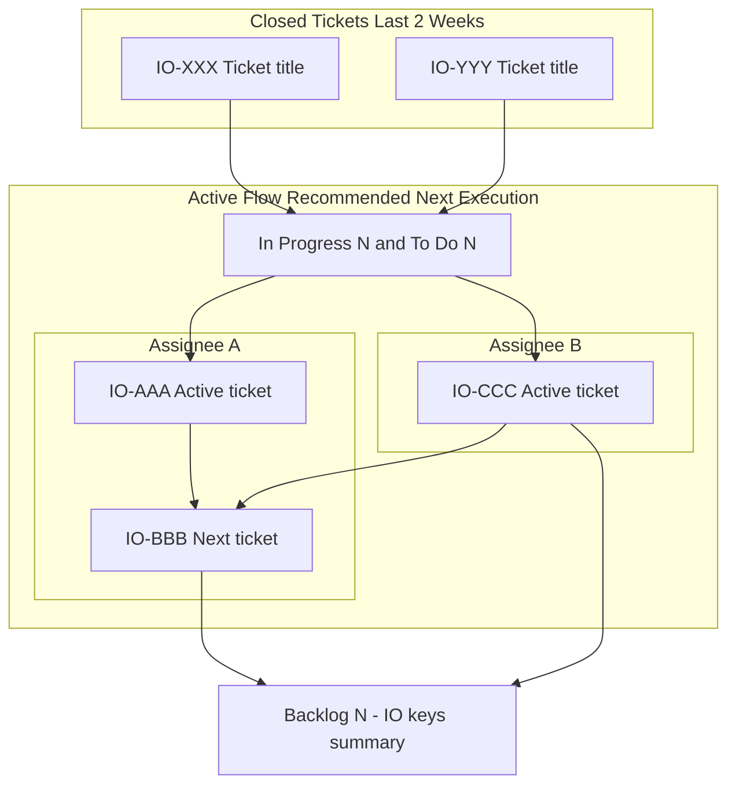
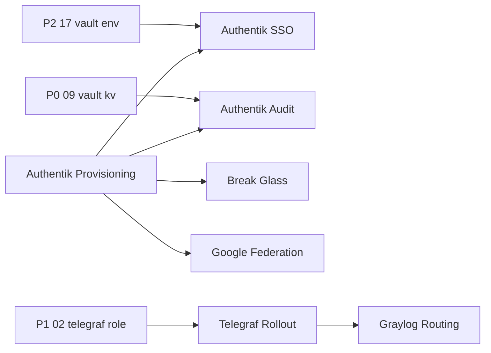

# Roadmap Graph Template (ROADMAP_GRAPH.md)

This file defines the graph content regenerated in `roadmap/ROADMAP_GRAPH.md` each run. Use multiple Mermaid graphs to avoid unreadable scaling.

Rules:

- First graph is a Jira weekly-catchup flow graph with three parts in one flow:
    1) closed tickets in the last 2 weeks (list all with ID + title),
    2) active execution flow grouped by assignee with recommended ticket order,
    3) one single backlog box at the end.
- In Jira weekly section, include metadata hygiene as text bullets above the Mermaid graph (coverage and remediation counts).
- In Jira weekly graph, explicitly draw cross-person dependency edges where applicable (for example, one engineer's phase tickets depending on another engineer's blocking ticket).
- Keep Jira weekly Mermaid nodes ticket-only (no non-ticket governance nodes).
- Second graph is a single cross-epic dependency graph (include epic-to-epic and epic-to-ticket dependencies).
- Then render one epic execution-sequence graph under a shared `## Epic Graphs` heading.
- In the epic graph, include epic nodes only (no ticket breakdown nodes).
- Use concise node labels; full details remain in `NEXT_EPICS.md` and `NEXT_TICKETS.md`.
- Use Mermaid-safe node ids (ASCII, underscore separators).
- Order epic nodes in the sequence by current priority order from `NEXT_EPICS.md`.

## Jira flow and prioritization graph

## Cross-epic dependency graph

## Epic Graphs

```mermaid
graph LR
    E1[OpenSCAP deployment and integration into fleet]
    E2[OpenVAS deployment and integration into fleet]
    E3[Patch automation]
    E4[Authentik user provisioning and migration]
    E5[Authentik service SSO integration]
    E6[Authentik audit forwarding to Graylog]
    E7[Break-glass SSSD cache clear automation]
    E8[Authentik and Google Workspace federation]
    E9[Fleet monitoring agents deployment with Telegraf tags]
    E10[Graylog per-application indices and routing]

    E1 --> E2 --> E3 --> E4 --> E5 --> E6 --> E7 --> E8 --> E9 --> E10
```

## Generation Notes

- Keep each graph small enough to render legibly without aggressive zoom-out.
- Keep a single epic sequence graph and order epic nodes by priority from `NEXT_EPICS.md` so meeting flow matches roadmap order.
- In Jira graph, always include ticket IDs and titles for closed-last-2-weeks tickets.
- In Jira graph, include assignee grouping and a recommended execution chain based on dependencies and current status.
- In Jira graph, keep backlog as one single terminal node/box to maximize readability.
- In Jira section, include metadata hygiene as text bullets above the graph.
- In Jira graph, surface cross-person dependencies explicitly as edges between assignee lanes.
